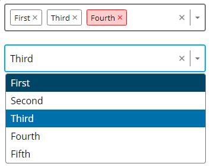

# Custom Select Element with React + TypeScript + Vite 

A fully keyboard accessible custom select element, can be used as single- or multiselect. Complete with ARIA-roles and WCAG 2 compliant color contrast.



## Try it out

```js
   //clone the repository, then:
   cd select_element
   npm i
   npm run dev
```

### Thanks to:

Based on the tutorial of [WebDevSimplified](https://github.com/WebDevSimplified) - thank you for the awesome content!